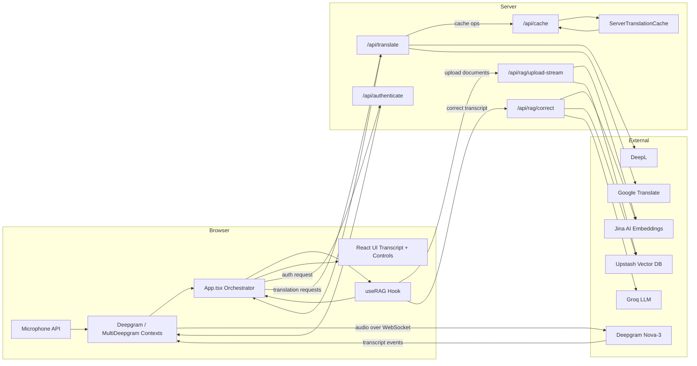
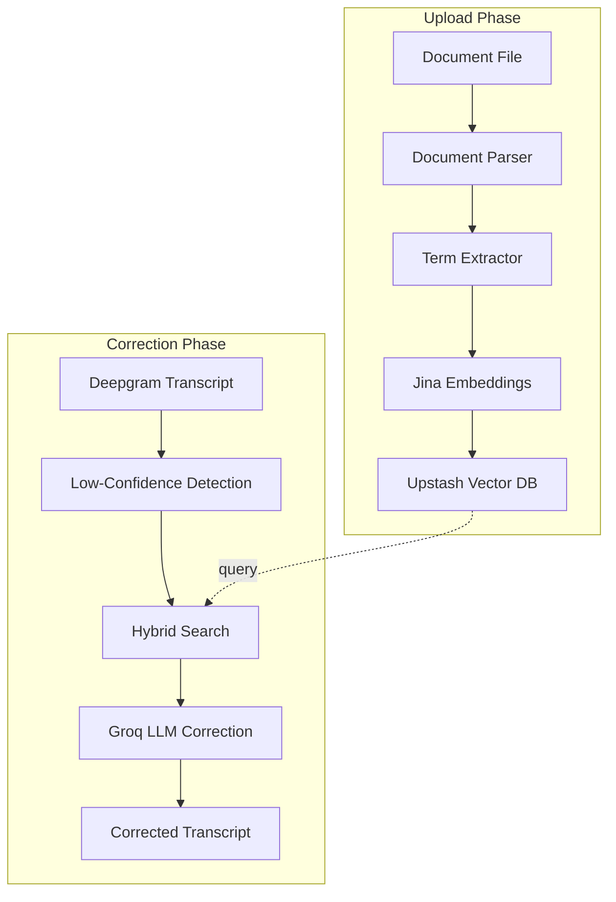

# LiveCaps Architecture and Codebase Walkthrough

This document is a single, detailed guide to how LiveCaps works: the runtime architecture, data flow, external services, and how the code is organized. It is written for software engineers who want to understand, debug, or extend the system.

---

## Table of Contents

1. [System Overview](#system-overview)
2. [Runtime Mental Model](#runtime-mental-model)
3. [External Services and Dependencies](#external-services-and-dependencies)
4. [Next.js App Structure](#nextjs-app-structure)
5. [End-to-End Data Flow](#end-to-end-data-flow)
6. [Single-Language Mode](#single-language-mode)
7. [Multi-Language Detection Mode](#multi-language-detection-mode)
8. [Translation System](#translation-system)
9. [Caching Architecture](#caching-architecture)
10. [Context Providers](#context-providers)
11. [Core UI Components](#core-ui-components)
12. [RAG Vocabulary Correction System](#rag-vocabulary-correction-system)
13. [Configuration and Environment](#configuration-and-environment)
14. [Error Handling and Resilience](#error-handling-and-resilience)
15. [Performance Characteristics and Tuning](#performance-characteristics-and-tuning)
16. [Extensibility and Future Work](#extensibility-and-future-work)

---

## 1. System Overview

LiveCaps is a browser-based real-time captioning system with optional live translation and domain-specific vocabulary correction. It is built on:

- **Next.js 14 (App Router)** for routing, server-side APIs, and static assets.
- **React 18** for the UI and client-side state management.
- **Deepgram Nova-3** for live speech-to-text over WebSockets.
- **DeepL** (with Google Translate as a fallback) for text translation.
- **RAG pipeline** (Upstash Vector + Jina AI + Groq) for vocabulary correction using uploaded documents.

The system is optimized for low end-to-end latency and a stable reading experience. It runs two main loops plus an optional correction step:

1. An **audio → text** loop that streams microphone audio to Deepgram and receives transcripts.
2. An optional **text → correction** step that uses RAG to fix low-confidence domain-specific words.
3. A **text → translation** loop that batches completed sentences, sends them to a translation API, and updates the UI as translations arrive.

All real-time behavior runs in the browser as client components and React context providers. Server-side code is limited to focused API routes for authentication, translation, caching, and RAG operations.

---

## 2. Runtime Mental Model

If you need one high-level model, use this:

> LiveCaps continuously streams audio to Deepgram, buffers transcript text into sentences, and asynchronously translates those sentences, updating a unified transcript on screen.

### 2.1 The two streaming loops

1. **Speech → Text loop**
   - The browser records audio in 100 ms chunks using the `MediaRecorder` API.
   - Each chunk is sent over a persistent WebSocket connection to Deepgram.
   - Deepgram streams back interim and final transcript events.

2. **Text → Translation loop**
   - As transcripts arrive, they are appended to a sentence buffer.
   - When the app decides a sentence is “complete enough,” it enqueues that sentence for translation.
   - A background worker on the client processes the queue, calling a Next.js translation API route.
   - When translations complete, the UI updates a unified transcript view.

The loops are decoupled so that translation latency never blocks ongoing transcription.

### 2.2 Client vs server responsibilities

- **Client (browser)**
  - Manages microphone permission and audio capture.
  - Owns WebSocket connections to Deepgram.
  - Buffers and segments text into sentences.
  - Maintains the translation queue and unified transcript state.
  - Renders the UI, including visualizations and mode toggles.

- **Server (Next.js route handlers)**
  - Serves the Next.js app and static assets.
  - Issues short-lived Deepgram API keys.
  - Proxies translation requests to DeepL/Google.
  - Maintains a server-side translation cache and exposes cache management endpoints.

### 2.3 High-level component diagram

The diagram below shows the main runtime components and how they connect:



---

## 3. External Services and Dependencies

### 3.1 Deepgram

LiveCaps uses **Deepgram Nova-3** via the official SDK `@deepgram/sdk` to handle live speech recognition:

- A WebSocket connection is created per Deepgram live session.
- Audio is sent in binary chunks as they are produced by `MediaRecorder`.
- The SDK emits transcript events, which are consumed by client logic in React.

Authentication is done via a short-lived key obtained from `/api/authenticate` on the server.

### 3.2 Translation providers

The translation API route at [app/api/translate/route.ts](app/api/translate/route.ts) orchestrates:

- **DeepL** (preferred provider) when `DEEPL_API_KEY` is set.
- **Google Translate** (unofficial HTTP endpoint) as a fallback.

The route handles:

- Input validation (text and target language).
- Provider selection and language code mapping.
- Error handling and normalized responses back to the client.

### 3.3 RAG pipeline services

The optional RAG (Retrieval-Augmented Generation) vocabulary correction system uses three external services:

- **Upstash Vector** – serverless vector database for storing and querying term embeddings. Each user session gets its own namespace for isolation. Terms are stored with metadata (original term, context, phonetic code, category, source file). Queried via REST API using `@upstash/vector`.

- **Jina AI** – embedding generation service using the `jina-embeddings-v3` model (768 dimensions). Used to convert extracted terms and search queries into semantic vectors. Results are cached in an LRU cache with 24-hour TTL to minimize API calls.

- **Groq** – fast LLM inference platform running `llama-3.3-70b-versatile`. Used for the final correction decision: given a transcript with low-confidence words and a list of candidate terms from the knowledge base, the model decides which replacements are appropriate in context. Temperature is set to 0.1 for deterministic output.

### 3.4 Browser APIs

The client uses several browser APIs:

- **MediaDevices / getUserMedia** for microphone access.
- **MediaRecorder** for chunked audio capture.
- **WebSocket** for Deepgram streaming.
- **Web Audio API** for audio visualization.
- **localStorage** for persisting UI preferences (e.g., dark mode, transcription mode).

---

## 4. Next.js App Structure

The root project is a Next.js 14 App Router application. At a high level:

- [app](app) contains all pages, API routes, components, and context providers.
- [public](public) contains static assets such as images and the main UI screenshot.

Key subdirectories under `app/`:

- [app/app](app/app) – page shell and layout for the main `/app` route.
- [app/components](app/components) – presentational and container components, including the main runtime component and the RAG upload UI.
- [app/context](app/context) – React Context providers for microphone, Deepgram, multi-language logic, and dark mode.
- [app/api](app/api) – route handlers for authentication, translation, caching, RAG operations, and tests.
- [app/api/rag](app/api/rag) – RAG-specific API routes: `upload-stream` (document indexing with SSE), `correct` (transcript correction), `session` (session management).
- [app/lib](app/lib) – server-side utilities including the translation cache and the full RAG pipeline (document parsing, term extraction, embeddings, phonetic matching, vector store, LLM correction).
- [app/hooks](app/hooks) – React hooks, including `useRAG` for managing RAG session state.
- [app/services](app/services) – client-side services (translation service, sentence detection, RAG API wrapper).
- [app/types](app/types) – TypeScript definitions including RAG interfaces and configuration types.
- [app/utils](app/utils) – small shared utilities (e.g., audio duplication, confidence comparison).

Supporting root files:

- [middleware.ts](middleware.ts) – CORS configuration for the auth endpoint.
- [next.config.js](next.config.js) – Next.js configuration and build options.
- [tailwind.config.ts](tailwind.config.ts) – Tailwind CSS configuration.
- [package.json](package.json) – dependencies and scripts.

---

## 5. End-to-End Data Flow

This section walks through what happens from the moment a user opens `/app` and grants microphone access.

### 5.0 Sequence diagram

The following sequence diagram shows the core interactions for a typical session in single-language mode:


### 5.1 Page load and initialization

1. The user navigates to `/app`.
2. The page component in [app/app/page.tsx](app/app/page.tsx) renders the main UI shell and mounts the primary runtime component [app/components/App.tsx](app/components/App.tsx).
3. Context providers from [app/context](app/context) are initialized:
   - Microphone context sets up `getUserMedia` and `MediaRecorder`.
   - Deepgram or MultiDeepgram context prepares WebSocket connections.
   - Dark mode and other UI preferences are loaded from localStorage.

### 5.2 Microphone setup and audio capture

The microphone context in [app/context/MicrophoneContextProvider.tsx](app/context/MicrophoneContextProvider.tsx) is responsible for:

- Requesting microphone access using `navigator.mediaDevices.getUserMedia({ audio: true })`.
- Creating a `MediaRecorder` bound to the audio stream.
- Configuring the recorder to emit `dataavailable` events every 100 ms.
- Handling permission errors and surfacing context state (e.g., `Ready`, `Recording`, `Error`) to the rest of the app.

As soon as recording starts, the browser begins emitting small audio blobs at regular intervals.

### 5.3 Deepgram WebSocket connection

The Deepgram context in [app/context/DeepgramContextProvider.tsx](app/context/DeepgramContextProvider.tsx):

1. Calls `/api/authenticate` to obtain a short-lived Deepgram API key.
2. Uses `@deepgram/sdk` to create a live client and open a WebSocket connection with the chosen language and model (Nova-3).
3. Attaches listeners for:
   - **Open** – marks the connection as ready.
   - **Transcription events** – passes transcript data to the App component.
   - **Error / Close** – updates connection state and logs debugging information.

In multi-language mode, [app/context/MultiDeepgramContextProvider.tsx](app/context/MultiDeepgramContextProvider.tsx) manages one such client per language instead of a single connection.

### 5.4 Streaming audio to Deepgram

The main App component subscribes to microphone events. For each 100 ms audio blob:

- In single-language mode, the blob is sent to the single Deepgram WebSocket.
- In multi-language mode, the blob is duplicated (using helpers in [app/utils](app/utils)) and sent to each active Deepgram connection managed by the `MultiDeepgramContextProvider`.

This keeps latency low and avoids large batches of audio.

### 5.5 Transcript buffering and sentence detection

As Deepgram emits transcript events, the App component:

- Maintains a buffer of the current partial sentence.
- Receives interim results for fast feedback and final results when Deepgram considers a segment stable.
- Uses a sentence detection helper in [app/services/translationService.ts](app/services/translationService.ts) to determine when a sentence is “complete.”

The sentence detector:

- Looks for sentence-ending punctuation (., !, ?).
- Handles common abbreviations and edge cases to avoid cutting sentences too early.
- Uses a timeout-based fallback to flush buffered text if the user pauses for too long.

When a sentence is considered complete, the buffer is flushed into a unified transcript block and the text is enqueued for translation.

### 5.6 Translation queue and API calls

A translation queue runs in the App component, powered by helpers in [app/services/translationService.ts](app/services/translationService.ts):

- Newly completed sentences are added to a queue.
- A worker loop processes items sequentially or in small batches.
- For each item, the client calls `/api/translate` with the text and target language.
- Responses are mapped back onto the correct transcript block(s) in state.

This queue ensures that the UI remains responsive even if the translation provider is slow or temporarily unavailable.

### 5.7 Rendering the unified transcript

The App component renders the transcript as an ordered list of blocks. Each block typically contains:

- The original sentence in the spoken language.
- One or more translated variants, depending on the configured target languages.
- Metadata such as language codes and (optionally) confidence or timestamps.

The UI supports both:

- A standard layout suitable for desktop viewing.
- A fullscreen mode optimized for projection in live events.

---

## 6. Single-Language Mode

Single-language mode is the simpler path and is the default when the user selects one spoken language.

### 6.1 Components and contexts involved

- [app/context/MicrophoneContextProvider.tsx](app/context/MicrophoneContextProvider.tsx)
- [app/context/DeepgramContextProvider.tsx](app/context/DeepgramContextProvider.tsx)
- [app/components/App.tsx](app/components/App.tsx)

### 6.2 Data flow specifics

1. A single Deepgram connection is opened with the chosen language and model.
2. All microphone audio is streamed to that connection.
3. Transcript events carry a single stream of text.
4. The App component processes events into sentences and unified transcript blocks.
5. The translation queue calls `/api/translate` for each new sentence, for each selected target language.

### 6.3 When to use

- The speaker’s language is known and fixed.
- You care primarily about stability and minimal resource usage.
- Multi-language detection is not required.

---

## 7. Multi-Language Detection Mode

Multi-language mode is designed for scenarios where the spoken language may vary between a small set of candidates (e.g., bilingual or multilingual events).

### 7.1 High-level behavior

- The user configures multiple possible spoken languages (e.g., English, Russian, Korean).
- The app opens one Deepgram WebSocket connection per language via [app/context/MultiDeepgramContextProvider.tsx](app/context/MultiDeepgramContextProvider.tsx).
- Each microphone audio chunk is duplicated to all active connections.
- Each connection produces its own stream of transcripts and confidence scores.
- A “winner selection” algorithm chooses the most likely transcript for a given time window.
- The winning transcript is fed into the same buffering and translation pipeline used in single-language mode.

#### 7.1.1 Multi-language flow diagram


### 7.2 Connections and state

`MultiDeepgramContextProvider` manages:

- A map of active Deepgram connections keyed by language or identifier.
- Per-connection state: connection status, last transcript, confidence, and health.
- Aggregated state so the UI can show a single status indicator (e.g., `OPEN`, `CONNECTING`, `ERROR`).

### 7.3 Audio duplication

Because each Deepgram connection expects its own audio stream, audio blobs are duplicated:

- Helpers in [app/utils](app/utils) handle cloning the binary data efficiently.
- Each clone is sent down a different WebSocket connection.

This fan-out ensures that every candidate model sees the same raw audio.

### 7.4 Winner selection

Winner selection is performed over a sliding time window:

1. For each window, the provider tracks the set of transcripts emitted by each connection along with associated confidence scores.
2. It compares confidences and selects the transcript with the highest confidence, optionally applying thresholds or tie-breakers.
3. Only the winning transcript propagates into the App’s sentence buffer.

This approach isolates downstream logic from multi-language complexity: from the perspective of [app/components/App.tsx](app/components/App.tsx), there is still just one incoming text stream.

### 7.5 Trade-offs

- **Pros**
  - Robust when the spoken language is not known in advance.
  - Avoids misconfiguration and wrong-language results.
- **Cons**
  - Uses more resources (multiple Deepgram connections).
  - Slightly more complex to tune and debug.

---

## 8. Translation System

The translation system spans both client and server code.

### 8.1 Client-side translation service

The client translation helpers in [app/services/translationService.ts](app/services/translationService.ts) provide:

- `translateText` – basic wrapper around the `/api/translate` endpoint.
- `translateBySentences` – higher-level utility for splitting text into sentences and translating them individually, while attempting full-text translation first.
- `detectSentences` – sentence boundary detection logic used by the App.

These helpers abstract away details like API URLs, error handling, and response normalization.

### 8.2 Server-side translation route

The route handler in [app/api/translate/route.ts](app/api/translate/route.ts):

1. Parses the incoming request JSON (text, target language).
2. Validates required fields.
3. Attempts a DeepL translation if `DEEPL_API_KEY` is configured.
4. Falls back to Google Translate’s HTTP endpoint if DeepL is unavailable or errors.
5. Returns a standardized JSON payload containing the translated text and provider metadata.

### 8.3 Language mapping

The translation route maintains a mapping between:

- UI language codes (e.g., `en`, `es`, `fr`).
- DeepL and Google Translate specific codes.

This ensures consistent user-facing language selection while still supporting provider-specific differences.

---

## 9. Caching Architecture

To reduce latency and external API costs, LiveCaps includes a server-side translation cache.

### 9.1 ServerTranslationCache singleton

[app/lib/translationCache.ts](app/lib/translationCache.ts) defines a singleton cache with:

- An in-memory `Map` keyed by text + language.
- A maximum entry count (e.g., 2000) with approximate LRU-style eviction.
- A TTL (Time-To-Live) for each entry.
- Periodic cleanup of expired entries.
- Statistics and introspection helpers (hit rate, size, top keys).

Because this is a singleton module, it persists across requests within a single Node.js process or serverless instance.

### 9.2 Cache management API

The `/api/cache` route at [app/api/cache/route.ts](app/api/cache/route.ts) exposes operations like:

- `GET /api/cache` – retrieves cache statistics.
- `GET /api/cache/clear` – clears all entries.
- `POST /api/cache/preload` – preloads a set of common phrases for a given language.

Preloading common phrases ensures that frequently used captions are available instantly when a session starts.

### 9.3 Integration with translation

The intended flow is:

1. On a translation request, check the cache first.
2. If there is a hit, return it immediately.
3. If there is a miss, call the external provider, then store the result in the cache.

This design significantly reduces the marginal cost of repeated translations (e.g., greetings, standard phrases) and improves tail latency.

---

## 10. Context Providers

React Contexts in [app/context](app/context) encapsulate cross-cutting concerns.

### 10.1 Microphone context

Defined in [app/context/MicrophoneContextProvider.tsx](app/context/MicrophoneContextProvider.tsx):

- Requests microphone access via `getUserMedia`.
- Creates and manages a `MediaRecorder` with a fixed chunk size.
- Exposes microphone state (e.g., `Idle`, `Pending`, `Recording`, `Error`).
- Provides callbacks for starting/stopping recording and subscribing to audio chunks.

### 10.2 Deepgram context (single-language)

Defined in [app/context/DeepgramContextProvider.tsx](app/context/DeepgramContextProvider.tsx):

- Obtains a Deepgram key from `/api/authenticate`.
- Creates a Deepgram live transcription client.
- Maintains connection state (`OPEN`, `CLOSED`, `CONNECTING`, etc.).
- Exposes methods for sending audio and subscribing to transcript events.

### 10.3 MultiDeepgram context (multi-language)

Defined in [app/context/MultiDeepgramContextProvider.tsx](app/context/MultiDeepgramContextProvider.tsx):

- Manages multiple Deepgram connections (one per language).
- Aggregates per-connection states into an overall status.
- Handles audio duplication and winner transcript selection.
- Exposes a single interface to the rest of the app, hiding the complexity of multiple connections.

### 10.4 Dark mode context

Defined in [app/context/DarkModeContextProvider.tsx](app/context/DarkModeContextProvider.tsx):

- Tracks the current theme (`light` or `dark`).
- Persists theme choice to localStorage.
- Applies the correct class to the document for Tailwind to style appropriately.

---

## 11. Core UI Components

The most important UI pieces live under [app/components](app/components).

### 11.1 App.tsx

[app/components/App.tsx](app/components/App.tsx) is the main orchestrator. It:

- Wires together microphone and Deepgram contexts.
- Configures transcription mode (single vs multi-language).
- Manages:
  - Session languages (spoken, display/target).
  - Transcript blocks and interim text.
  - The translation queue.
  - Sentence buffering and detection.
  - Fullscreen and layout state.
- Renders:
  - The main transcript view.
  - Language selectors and transcription mode toggles.
  - The audio visualizer.
  - Errors and connection status.

### 11.2 Language selectors and toggles

- Language selectors for spoken and display languages live in [app/components](app/components).
- A transcription mode toggle controls whether the app uses single- or multi-language mode and persists the choice.

### 11.3 Visualizer and layout components

- The visualizer uses the Web Audio API to show simple audio level feedback.
- Layout components manage responsive behavior and projector-friendly fullscreen mode.

---

## 12. RAG Vocabulary Correction System

The RAG (Retrieval-Augmented Generation) system is an optional feature that improves transcription accuracy for domain-specific vocabulary. Users upload presentation materials before a session, and the system learns the terminology to correct recognition errors in real time.

### 12.1 Motivation

Speech recognition models work well for common language but often struggle with specialized vocabulary: product names, technical jargon, people's names, acronyms, and organization names. The RAG system addresses this by building a per-session knowledge base from user-uploaded documents and using it to correct low-confidence words during live transcription.

### 12.2 Architecture overview

The RAG system has two main phases:

1. **Upload phase** – documents are parsed, terms extracted, embedded, and indexed.
2. **Correction phase** – low-confidence transcript words are matched against the knowledge base and corrected.



### 12.3 Upload pipeline

The upload pipeline processes documents in four stages, reported to the client via Server-Sent Events (SSE):

#### Stage 1: Document parsing ([app/lib/documentParser.ts](app/lib/documentParser.ts))

Extracts raw text from uploaded files:

| Format | Library | Details |
|--------|---------|---------|
| PDF | `unpdf` | Extracts text from all pages |
| DOCX | `mammoth` | Extracts paragraphs as plain text |
| PPTX | `JSZip` | Parses the ZIP archive, reads slide XML (`ppt/slides/slide*.xml`) and speaker notes |
| TXT | native | Direct text read |
| MD | native | Direct text read |

Maximum file size: 10 MB. The parser returns the raw text, file metadata, and processing time.

#### Stage 2: Term extraction ([app/lib/termExtractor.ts](app/lib/termExtractor.ts))

Analyzes the parsed text to identify important domain-specific terms:

- **Proper nouns** – capitalized words in mid-sentence (e.g., "Kubernetes", "Dr. Smith")
- **Technical terms** – camelCase, snake_case, kebab-case identifiers
- **Acronyms** – uppercase sequences (e.g., "API", "OAuth2", "HTTP")
- **Multi-word phrases** – named entities like "New York City", "Google Cloud Platform"

Each extracted term includes:
- The term itself and its normalized form
- Surrounding context (2–3 sentences)
- Phonetic code (Soundex)
- Frequency count
- Category (`person`, `organization`, `product`, `technical`, `acronym`, `general`)
- Source file and location

#### Stage 3: Embedding generation ([app/lib/embeddingsService.ts](app/lib/embeddingsService.ts))

Converts terms into 768-dimensional semantic vectors using Jina AI:

- **Model:** `jina-embeddings-v3`
- **Batch processing:** up to 150 terms per batch
- **Rate limiting:** 25 ms delay between API calls
- **Caching:** LRU cache (10,000 entries, 24-hour TTL)
- **Fallback:** hash-based embeddings if the Jina API is unavailable

Each term is embedded as a text string combining the term and its context (e.g., `"Kubernetes: orchestrates containerized applications across clusters"`).

#### Stage 4: Vector indexing ([app/lib/vectorStore.ts](app/lib/vectorStore.ts))

Stores embeddings in Upstash Vector with rich metadata:

- **ID format:** `{sessionId}_{normalizedTerm}_{sourceFile}`
- **Metadata:** term, normalized form, context, phonetic code, category, session ID, source file
- **Session isolation:** all vectors for a session share a common session ID in metadata, enabling scoped queries
- **Batch upsert:** processes all terms in a single batch operation

### 12.4 Correction pipeline

When a transcript arrives with low-confidence words, the correction pipeline activates:

#### Step 1: Low-confidence detection ([app/lib/corrector.ts](app/lib/corrector.ts))

- Deepgram provides word-level confidence scores (0–1) with each transcript.
- Words with confidence below the threshold (default: 0.7) are flagged for potential correction.
- Adjacent low-confidence words are grouped into phrases (e.g., "cooper" + "netties" → "cooper netties").

#### Step 2: Query building

For each low-confidence word or phrase, multiple search queries are generated:
- The word/phrase itself
- The phrase with surrounding context words (one word before/after)
- Individual words from multi-word phrases

This ensures broad coverage when searching the knowledge base.

#### Step 3: Hybrid search ([app/lib/vectorStore.ts](app/lib/vectorStore.ts), [app/lib/phoneticMatcher.ts](app/lib/phoneticMatcher.ts))

Two search strategies run in parallel and their results are combined:

**Semantic search (weight: 0.6)**
- The query is embedded using Jina AI
- Upstash Vector is queried for the top-K most similar vectors (default K=10)
- Returns terms ranked by cosine similarity

**Phonetic search (weight: 0.4)**
- Soundex and Metaphone codes are generated for the query
- All terms in the session are compared phonetically
- Levenshtein distance on phonetic codes determines similarity
- Returns terms ranked by phonetic similarity

**Score combination:**
```
combinedScore = (semanticScore × 0.6) + (phoneticScore × 0.4)
```

Results below the similarity threshold (default: 0.75) are discarded. The remaining candidates are ranked by combined score.

#### Step 4: LLM correction ([app/lib/llmCorrection.ts](app/lib/llmCorrection.ts))

The top candidate terms and the full transcript are sent to Groq's Llama 3.3 70B model:

- **Temperature:** 0.1 (highly deterministic)
- **Max tokens:** 512
- **Timeout:** 5 seconds
- The prompt instructs the model to only replace words that sound similar to a knowledge base term, preserving original words when uncertain
- The model returns structured JSON with the corrected transcript and an array of corrections with reasons

**Fallback:** If the LLM is unavailable (no API key, timeout, or error), a rule-based fallback applies corrections based on combined similarity scores alone.

### 12.5 Frontend integration

**RAGUpload component** ([app/components/RAGUpload.tsx](app/components/RAGUpload.tsx))
- Drag-and-drop file upload interface
- Real-time progress tracking via SSE
- Displays indexed term counts and category breakdown
- Supports multiple file uploads per session

**useRAG hook** ([app/hooks/useRAG.ts](app/hooks/useRAG.ts))
- Manages RAG session state (session ID, active status, statistics)
- Persists session ID to localStorage
- Provides `correctTranscript()` method consumed by the App component
- Handles batching and debouncing of correction requests

**ragService** ([app/services/ragService.ts](app/services/ragService.ts))
- Client-side wrapper for all RAG API endpoints
- Handles SSE stream parsing for upload progress
- Error handling and retry logic

### 12.6 API endpoints

| Endpoint | Method | Purpose |
|----------|--------|---------|
| `/api/rag/upload-stream` | POST | Upload a document, index terms, stream progress via SSE |
| `/api/rag/correct` | POST | Correct a transcript using the session's knowledge base |
| `/api/rag/session` | GET | Retrieve session statistics (term count, categories, documents) |
| `/api/rag/session` | DELETE | Delete a session and all its indexed terms |
| `/api/rag/upload` | POST | Non-streaming document upload (alternative to upload-stream) |

### 12.7 Data types

All RAG data structures are defined in [app/types/rag.ts](app/types/rag.ts):

- `ExtractedTerm` – a term with context, phonetic code, category, and frequency
- `UploadedContent` – parsed document content with extracted terms
- `WordConfidence` – Deepgram word-level confidence data
- `CorrectionRequest` / `CorrectionResponse` – correction API contracts
- `CorrectionDetail` – individual correction with original, corrected, reason, and match type
- `VectorSearchResult` – hybrid search result with semantic, phonetic, and combined scores
- `RAGConfig` – system configuration with defaults (`DEFAULT_RAG_CONFIG`)
- `RAGSessionStats` – session statistics for the management API

### 12.8 Error handling and resilience

The RAG system is designed to fail gracefully without affecting core transcription:

- If the Jina API is unavailable, hash-based fallback embeddings are used
- If the Groq API is unavailable, rule-based corrections are applied using similarity scores
- If vector search fails, the original transcript is returned unchanged
- All RAG operations have timeouts (3–5 seconds) to prevent blocking
- The system is entirely optional: if `RAG_ENABLED` is not `true`, all RAG endpoints return early

---

## 13. Configuration and Environment

### 13.1 Environment variables

Key environment variables include:

- `DEEPGRAM_API_KEY` – required for Deepgram access.
- `DEEPGRAM_ENV` – optional environment tag (e.g., `development`).
- `DEEPL_API_KEY` – optional, used to enable DeepL translations.

RAG-specific variables (all optional):

- `RAG_ENABLED` – set to `true` to enable the RAG correction system.
- `UPSTASH_VECTOR_REST_URL` – Upstash Vector database REST URL.
- `UPSTASH_VECTOR_REST_TOKEN` – Upstash Vector database authentication token.
- `JINA_API_KEY` – Jina AI API key for embedding generation.
- `GROQ_API_KEY` – Groq API key for LLM correction. If not set, rule-based fallback is used.
- `RAG_CONFIDENCE_THRESHOLD` – override the default confidence threshold (0.7).

A starter file at [sample.env.local](sample.env.local) lists required and optional variables. In development, you typically:

1. Copy `sample.env.local` to `.env.local`.
2. Fill in the key values.
3. Run `npm run dev`.

### 13.2 Build and runtime configuration

- [next.config.js](next.config.js) configures Next.js build behavior.
- [tailwind.config.ts](tailwind.config.ts) configures Tailwind CSS.
- [middleware.ts](middleware.ts) configures CORS for specific API routes (e.g., `/api/authenticate`).

---

## 14. Error Handling and Resilience

The system is designed to degrade gracefully when external services are unavailable.

- **Deepgram errors**
  - Connection errors and closures are logged with details.
  - Connection state is updated so the UI can show appropriate feedback.

- **Translation errors**
  - If DeepL fails, the system falls back to Google Translate.
  - If both fail, errors are propagated back to the client; the original text can still be displayed.

- **Microphone errors**
  - Permission denials and hardware issues are captured in the microphone context state.
  - The UI can surface a clear error message and suggest remediation.

- **Cache API errors**
  - Cache operations are isolated; failures do not affect the core streaming loops.

---

## 15. Performance Characteristics and Tuning

LiveCaps aims for low perceived latency and a smooth reading experience.

### 15.1 Latency targets

- **Audio chunking** – 100 ms chunks balance responsiveness and overhead.
- **Speech-to-text** – Deepgram typically responds within ~100 ms under normal network conditions.
- **Translation** – 200–500 ms per sentence is typical, with faster responses for cache hits.

### 15.2 Tuning knobs

Several parameters can be tuned:

- **Deepgram options** in [app/context/DeepgramContextProvider.tsx](app/context/DeepgramContextProvider.tsx) and [app/context/MultiDeepgramContextProvider.tsx](app/context/MultiDeepgramContextProvider.tsx):
  - Model selection (e.g., `nova-3`).
  - Endpointing / utterance end configuration.
  - Interim result behavior.

- **Sentence detection** in [app/services/translationService.ts](app/services/translationService.ts):
  - Punctuation rules.
  - Timeout thresholds for flushing partial buffers.

- **Translation queue behavior** in [app/components/App.tsx](app/components/App.tsx):
  - Batch size.
  - Concurrency (if expanded in the future).

- **Cache size and TTL** in [app/lib/translationCache.ts](app/lib/translationCache.ts):
  - Maximum entries.
  - Entry lifetime before eviction.

---

## 16. Extensibility and Future Work

The architecture leaves room for several natural extensions:

- **Additional translation providers**
  - Implement new provider clients in the translation route and update selection logic.

- **Per-phrase customization**
  - Add user-defined translations or glossary-like features, integrated with the cache.

- **Richer multi-language heuristics**
  - Improve winner selection by considering more than just confidence (e.g., language model priors, session history).

- **Persistence and analytics**
  - Store transcripts and translations in a database for later review, search, or analytics.

- **Accessibility enhancements**
  - Support for different fonts, color schemes, and layout modes tuned for various environments.

---

This document should provide enough context to navigate the codebase, follow the runtime data flow, and make informed changes to the system. For implementation details, refer to the linked files in the repository under [app](app) and the root-level configuration and documentation files.
