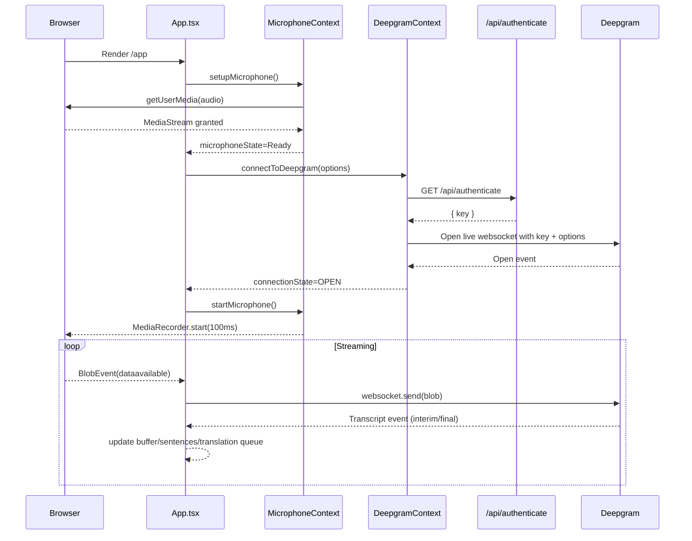
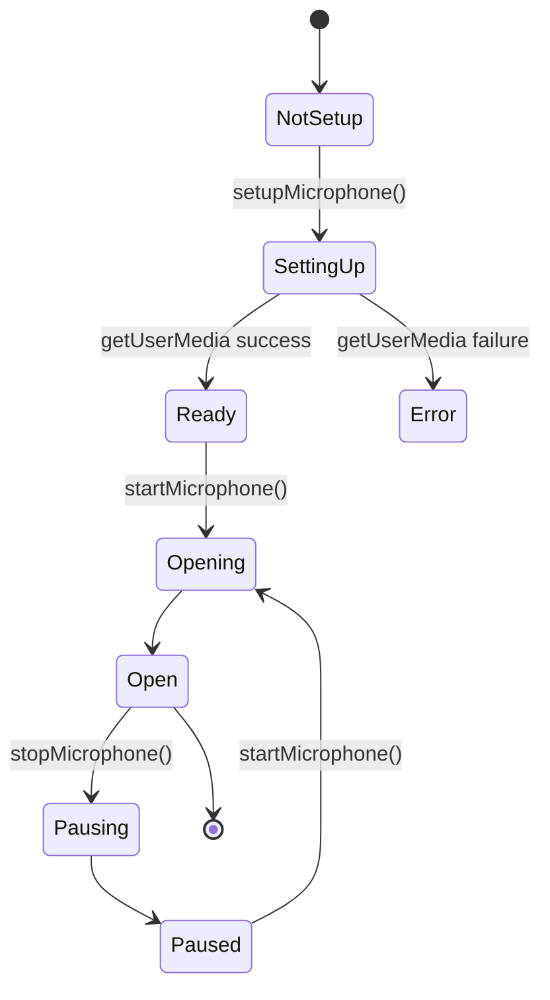

# LiveCaps Codebase Walkthrough (Deprecated)

This end-to-end walkthrough has been replaced by the consolidated architecture and codebase guide:

- [ARCHITECTURE_AND_WALKTHROUGH.md](ARCHITECTURE_AND_WALKTHROUGH.md)

That document now covers the runtime mental model, data flow, frontend orchestration, Deepgram integration, translation API, and caching in a single place.

This file is retained only so existing links continue to resolve.

LiveCaps uses Next.js, which can run code in two main places:

- **Client (browser):** React components, microphone access, Web Audio visualization, WebSocket streaming.
- **Server (Next.js route handlers):** endpoints like `/api/authenticate`, `/api/translate`, `/api/cache`.

In this repo:

- The main UI and orchestration is browser-side (client components).
- Secrets (API keys) are read on the server side in API routes.

### 0.3 Quick local setup checklist

1) Copy `sample.env.local` → `.env.local`
2) Set at minimum:

```bash
DEEPGRAM_API_KEY=...
DEEPGRAM_ENV=development
```

3) Optional (higher translation quality):

```bash
DEEPL_API_KEY=...
```

4) Run:

```bash
npm install
npm run dev
```

5) Open:

- `/` for the landing page
- `/app` for the transcription + translation UI

---

## 1) What LiveCaps is (in architectural terms)

LiveCaps is a browser-based live captioning pipeline with optional live translation:

- **Audio capture** happens in the browser using the **MediaDevices** + **MediaRecorder** APIs.
- Audio chunks are streamed to **Deepgram Live Transcription** over a WebSocket.
- Deepgram emits **interim transcripts** (fast, partial) and **final transcripts** (stable).
- The app groups transcript text into **sentences** and maintains an internal buffer.
- Sentences are translated asynchronously using a backend API route, with a batching queue to avoid UI stalls.

At a high level, it’s an event-driven, streaming system:

- Audio is a stream (chunks) → transcript is a stream (events) → UI state is a stream (incremental updates).

### 1.1 “Event-driven” means: callbacks change state

Instead of “call a function and get a result,” this system waits for events:

- MediaRecorder emits `dataavailable` events (audio chunks).
- Deepgram emits transcript events (interim/final).

The core UI state updates happen in response to these events.

### 1.2 Why WebSockets are used here

Speech-to-text works best as a low-latency stream. A WebSocket:

- stays open
- allows sending audio chunks continuously
- allows receiving transcript updates continuously

This avoids the overhead of making a new HTTP request for every 100ms chunk.

---

## 2) Repo layout (where things live)

Key folders/files:

- `app/`
  - `layout.tsx` — root layout and global providers.
  - `page.tsx` — landing page at `/`.
  - `app/page.tsx` — main app page at `/app`.
  - `components/` — UI components (main `App.tsx`, language selector, visualizer, footer, theme toggle).
  - `context/` — React Context providers (Deepgram, Microphone, Dark Mode).
  - `api/` — Next.js route handlers (authenticate, translate, cache, test endpoint).
  - `lib/` — server-side translation cache singleton.
  - `services/` — client-side translation utilities.

- `middleware.ts` — CORS configuration for `/api/authenticate`.
- `next.config.js` — build settings (notably skips TS + ESLint checks during build).
- `sample.env.local` — environment variable template.

### 2.1 File-purpose map (quick reference)

- **Pages & layout**
  - `app/layout.tsx`: global providers + global CSS
  - `app/page.tsx`: marketing/landing page
  - `app/app/page.tsx`: actual application shell (header + <App />)

- **Core brain**
  - `app/components/App.tsx`: “stream everything, update state, render panels”

- **Contexts (global state + APIs)**
  - `app/context/MicrophoneContextProvider.tsx`: mic permission + MediaRecorder
  - `app/context/DeepgramContextProvider.tsx`: Deepgram WS connection
  - `app/context/DarkModeContextProvider.tsx`: theme toggle + localStorage

- **Backend routes**
  - `app/api/authenticate/route.ts`: returns a key usable by the browser
  - `app/api/translate/route.ts`: translates text (DeepL or fallback)
  - `app/api/cache/route.ts`: cache stats / clear / preload phrases

- **Server library**
  - `app/lib/translationCache.ts`: singleton in-memory cache object

- **Client helpers**
  - `app/services/translationService.ts`: fetch wrappers + sentence formatting

---

## 3) The runtime: the critical path

This section is intentionally repetitive: it first shows diagrams, and then walks through the same pipeline in slow motion so you can build intuition.

### 3.1 System diagram (component + data flow)

```mermaid
flowchart LR
  User((User speaking)) -->|sound waves| Mic[Browser Microphone]
  Mic -->|MediaStream| MR[MediaRecorder\n100ms chunks]
  MR -->|BlobEvent: dataavailable| DGWS[Deepgram WebSocket\nLive Transcription]
  DGWS -->|Transcript events| APP[React App Orchestrator\napp/components/App.tsx]

  APP -->|final text| SB[Sentence Buffer\n+ Dedup Set]
  APP -->|interim text| UI1[Original Panel\n(interim + buffer)]

  SB -->|complete sentences| Q[Translation Queue\n(batch=3)]
  Q -->|POST /api/translate| API[Next.js Route Handler\napp/api/translate/route.ts]
  API --> DL[DeepL API\n(if configured)]
  API --> GT[Google Translate\n(fallback)]

  API -->|translatedText| Q
  Q -->|update translatedSentences[]| UI2[Translation Panel]

  APP -->|optional POST /api/cache preload| CacheAPI[Cache API\napp/api/cache/route.ts]
  CacheAPI --> Cache[(ServerTranslationCache\napp/lib/translationCache.ts)]
```

### 3.2 Sequence diagram (what happens after page load)



---

### 3.3 The “slow motion” narrative (what you’d observe in DevTools)

If you open the app and watch logs + network:

1) The `/app` page renders a header and the `App` component.
2) The microphone context asks for permission.
3) When permission is granted, the app calls `/api/authenticate`.
4) `/api/authenticate` returns a key.
5) The Deepgram SDK opens a WebSocket connection.
6) The microphone starts recording and emits `dataavailable` blobs every 100ms.
7) Each blob is sent to Deepgram.
8) Deepgram sends transcript events:
  - interim: updates the UI quickly
  - final: gets buffered/segmented and eventually enqueued for translation
9) Translation queue batches sentences and calls `/api/translate`.
10) The translation panel updates as translations arrive.

The important part: transcription continues even if translation lags.

## 4) Next.js structure: routes, rendering, and client components

### 4.1 App Router basics in this project

This repo uses **Next.js App Router** (`app/` directory). Pages are file-system routes:

- `app/page.tsx` → `/` (landing page)
- `app/app/page.tsx` → `/app` (main application)

Both pages are **client components** (`"use client"` at the top), meaning they render primarily on the client and can use hooks (`useEffect`, `useState`, etc.).

#### What is a “route handler” in this repo?

In Next.js App Router, anything under `app/api/**/route.ts` becomes an HTTP endpoint. For example:

- `app/api/translate/route.ts` → `POST /api/translate`

These run on the server side (Node.js in dev; serverless/edge in production depending on deployment).

### 4.2 Root layout

`app/layout.tsx` wraps the app with global providers:

- `DarkModeContextProvider`
- `MicrophoneContextProvider`
- `DeepgramContextProvider`

This ensures any descendant component can call:

- `useDarkMode()`
- `useMicrophone()`
- `useDeepgram()`

without prop-drilling.

---

## 5) Microphone capture (MediaDevices + MediaRecorder)

The microphone pipeline lives in `app/context/MicrophoneContextProvider.tsx`.

### 5.1 Key concepts

- **MediaDevices.getUserMedia**: prompts for microphone permission and returns a **MediaStream**.
- **MediaRecorder**: encodes that MediaStream into audio chunks.
- **timeslice**: calling `MediaRecorder.start(100)` emits a `dataavailable` event roughly every 100ms.

#### What is a BlobEvent?

When MediaRecorder fires `dataavailable`, you get a `BlobEvent` that contains a `Blob` (binary data). That blob represents a short audio segment that can be sent over the network.

In this app, those blobs are sent directly into the Deepgram WebSocket.

### 5.2 State machine

The provider implements a simplified microphone lifecycle using `MicrophoneState`.



### 5.3 Why 100ms chunks

Shorter chunks generally reduce latency in streaming STT, because the downstream model receives audio frequently.

Tradeoffs:

- Smaller chunks → lower latency, higher overhead.
- Larger chunks → less overhead, more latency.

100ms is a common compromise.

---

## 6) Deepgram live transcription (WebSocket + events)

Two sides participate:

- **Client**: `app/context/DeepgramContextProvider.tsx`
- **Server**: `app/api/authenticate/route.ts` (issues a temporary key or returns the dev key)

### 6.1 Why `/api/authenticate` exists

Browsers should not hold long-lived privileged credentials for service management. The route is used to either:

- Return the environment key in dev (simple local experience), or
- Generate a short-lived project key at runtime.

#### Why is this more secure?

If the browser held your full Deepgram key, a user could extract it from DevTools and use it elsewhere. By generating a **short-lived key** server-side, you limit blast radius. Even if exposed, it expires quickly.

In development mode (controlled by `DEEPGRAM_ENV=development`), the code chooses convenience and returns the env key directly.

### 6.2 DeepgramContext responsibilities

`DeepgramContextProvider`:

- Fetches a key from `/api/authenticate`.
- Creates a Deepgram client via `@deepgram/sdk`.
- Opens a live transcription WebSocket.
- Exposes:
  - `connection` (the live client)
  - `connectionState` (open/closed/connecting)
  - `connectToDeepgram(options)`

#### Deepgram event types used

The app relies on two Deepgram events:

- `Transcript`: carries text updates, including `is_final`.
- `UtteranceEnd`: Deepgram’s signal that the speaker paused (useful for flushing partial buffers).

### 6.3 Options sent to Deepgram

In `app/components/App.tsx`, once the microphone is ready, it calls `connectToDeepgram` with options similar to:

- `model`: set to `"nova-2"` in current code
- `interim_results: true`
- `smart_format: true`
- `punctuate: true`
- `utterance_end_ms: 1500`
- `vad_events: true`

These tune how quickly Deepgram finalizes text and how it formats punctuation.

### 6.4 Keep-alives

`App.tsx` periodically sends `connection.keepAlive()` (every 10 seconds) when the microphone is not open but the connection is open.

This is a common technique for:

- preventing idle timeouts
- keeping the socket warm

---

## 7) The orchestrator: `App.tsx`

`app/components/App.tsx` is the “brain” of the application.

It owns the application state, controls the streaming connections, detects sentence boundaries, and schedules translations.

### 7.1 Core state

The key state variables:

- `completeSentences: string[]`
- `translatedSentences: string[]`
- `currentInterimText: string`
- `selectedLanguage: Language`
- `isFullscreen: boolean`

And important refs:

- `processedFinalTexts: Set<string>` — deduplicates Deepgram final results.
- `currentSentenceBuffer: string` — accumulates text that is not yet a “complete sentence”.
- `translationQueue` — array of queued translation jobs.
- `isProcessingTranslation` — queue lock.

#### Why so many refs?

React state (`useState`) triggers re-renders. Refs (`useRef`) are mutable values that persist across renders *without* forcing a re-render.

This app uses refs for:

- Queue state and locks (to avoid rerendering on every queue mutation)
- Buffers and counters (to keep high-frequency streaming logic fast)
- Dedup set (so “final transcript repeated” doesn’t re-translate)

### 7.2 Event inputs

There are two main incoming event streams:

1) **MediaRecorder `dataavailable` events**

- Each event contains a Blob.
- `App.tsx` sends blobs to the Deepgram WebSocket.

Important iOS Safari detail: the code avoids sending a **0-byte blob**, because that can close the connection.

2) **Deepgram transcript events**

- Interim transcript → update `currentInterimText`.
- Final transcript → commit to buffer + sentence detection.

### 7.3 Handling interim vs final transcripts

**Interim** results:

- Displayed immediately for responsiveness.
- Not used for stable sentence segmentation.

**Final** results:

- Checked for duplication.
- Merged with buffer.
- Parsed for complete sentences.
- Enqueued for translation.

This pattern reduces flicker and avoids repeatedly translating unstable partial phrases.

#### “Deduplication” explained

Some streaming STT providers may emit final segments that overlap or repeat. The `processedFinalTexts` set is a guard so that if the same final string appears again, the app doesn’t treat it as new content.

### 7.4 Sentence buffering and “utterance end”

The app uses two strategies to decide when buffered text should be treated as a sentence:

1) If sentence punctuation appears and quality heuristics pass → treat as complete.
2) If Deepgram emits an `UtteranceEnd` event (speaker pause) or a timeout fires → flush buffer into a sentence.

This is an important real-time UX technique: users pause in natural speech; sentence punctuation may appear late or inconsistently.

#### Why the buffer timeout exists

If a user says something that never ends with clear punctuation (or Deepgram never inserts punctuation), you still want the translation panel to progress. A timeout provides a fallback: after a short pause, “good enough” buffered text becomes a sentence.

---

## 8) Translation architecture (client + server)

### 8.1 Client translation service

`app/services/translationService.ts` contains:

- `translateText()` → `fetch('/api/translate')`
- `translateBySentences()` → tries full text first, then falls back to per-paragraph translation
- Sentence formatting helpers
- `cacheUtils` → calls `/api/cache` endpoints

In other words:

- Client handles **when** and **how** to request translation.
- Server route handles **which provider** to use.

#### What’s the payload?

The client sends:

```json
{
  "text": "...",
  "targetLanguage": "es"
}
```

The server responds with something like:

```json
{
  "translatedText": "...",
  "provider": "deepl"
}
```

### 8.2 Translation queue in `App.tsx`

Translation is intentionally **non-blocking**:

- new sentences push items into `translationQueue`
- `processTranslationQueue()` runs asynchronously
- batch size is capped (default `BATCH_SIZE = 3`)

This prevents UI “stalls” where transcription stops updating while translations are in-flight.

#### Why batching helps

If you translate sentence-by-sentence with a network call per sentence, you can quickly overwhelm rate limits and add overhead. Batching is a common performance trick:

- fewer HTTP requests
- better throughput
- less time in “loading” states

```mermaid
flowchart TD
  A[New final transcript] --> B[Extract complete sentences]
  B --> C[Append placeholders in translatedSentences]
  C --> D[queueTranslation(sentences, lang, startIndex)]
  D --> E[processTranslationQueue async]
  E --> F[translateSentencesWithContext]
  F --> G[setTranslatedSentences functional update]
```

### 8.3 Provider selection on server

`app/api/translate/route.ts`:

1) Attempts **DeepL** if `DEEPL_API_KEY` exists and is valid.
2) If DeepL is missing or fails, uses Google Translate fallback.

#### Why there’s a “fallback” at all

DeepL is higher quality, but requires setup and can fail (quota, network, invalid key). The fallback keeps the app functioning even when DeepL isn’t available.

### 8.4 Server-side cache (what exists vs what’s used)

There is a server cache singleton:

- `app/lib/translationCache.ts` exports `serverTranslationCache`.

And a cache management API:

- `app/api/cache/route.ts`
  - `GET ?action=stats` (detailed stats)
  - `GET ?action=clear`
  - `POST { action: 'preload', targetLanguage }` (preload common phrases using Google)

However:

- **`/api/translate` does not currently consult `serverTranslationCache`**.
- This means “cache hits” won’t happen for real translation calls yet, even though the cache infrastructure exists.

If you want, a future change can implement:

- cache keying on `(text, targetLanguage)`
- `get()` before calling providers
- `set()` after successful translations

That would align runtime behavior with the design described in `TECHNICAL_DOCUMENTATION.md`.

---

## 9) Language selection and auto-detect mode

### 9.1 LanguageSelector UI

`app/components/LanguageSelector.tsx` defines a fixed list of languages including:

- `'auto'` (Auto-Detect)
- `'en'`, `'ru'`, `'es'`, `'fr'`, `'ja'`, `'ko'`, `'zh'`

### 9.2 Auto-detection logic

In `App.tsx`, auto-detection is implemented client-side using `franc-min`:

- It detects language from final transcript snippets.
- Then chooses a target language (currently heuristic: Russian↔English, other→English).

This is distinct from Deepgram’s `language` option; the code currently sets `language: "ru"` in the Deepgram options with a comment about handling detection client-side.

---

## 10) UI rendering modes and scrolling

### 10.1 Normal vs fullscreen layout

`App.tsx` has two render modes:

- Normal mode: two panels, fixed height scroll areas, audio visualizer.
- Fullscreen mode: fixed overlay with two columns, larger font size.

### 10.2 Auto-scroll strategy

It uses:

- `useEffect` with `requestAnimationFrame(scrollToBottom)` when state updates
- `MutationObserver` watchers for more robust scrolling when DOM changes

This is a pragmatic approach for live-updating transcript surfaces.

---

## 11) The audio visualizer

`app/components/Visualizer.tsx` uses the **Web Audio API**:

- Creates an `AudioContext` and `AnalyserNode`.
- Connects the microphone’s MediaStream to the analyser.
- Renders frequency bars to a `<canvas>` on every animation frame.

Key concepts:

- `requestAnimationFrame` for 60fps-ish drawing loop.
- `getByteFrequencyData()` for spectrum amplitude values.

#### Web Audio in one paragraph

The Web Audio API treats audio like a graph of nodes. Here, the microphone stream is turned into a source node, piped into an analyser node, and then the analyser provides numbers (frequency magnitudes) that you draw as bars.

---

## 12) Dark mode

`app/context/DarkModeContextProvider.tsx`:

- Keeps `isDarkMode` state.
- Persists preference in `localStorage`.
- Applies/removes the `dark` class on `<html>`.

Tailwind is configured with `darkMode: 'class'` in `tailwind.config.ts`.

---

## 13) Middleware and CORS

`middleware.ts` sets CORS headers based on environment variables:

- `ALLOWED_METHODS`
- `ALLOWED_ORIGIN`
- `ALLOWED_HEADERS`
- `EXPOSED_HEADERS`
- `PREFLIGHT_MAX_AGE`
- `CREDENTIALS`

Important: the middleware matcher is currently:

- `matcher: "/api/authenticate"`

So only the auth endpoint is covered, not `/api/translate` or `/api/cache`.

If you only ever run the app and APIs on the same origin (typical Next.js deployment), you often don’t need cross-origin CORS at all. This looks like it was added to support a specific embedding or cross-origin usage of `/api/authenticate`.

---

## 14) Environment variables and operational modes

Template is in `sample.env.local`.

Common env vars:

- `DEEPGRAM_API_KEY`
- `DEEPGRAM_ENV` — when `development`, `/api/authenticate` returns the env key directly
- `DEEPL_API_KEY` — optional, enables DeepL

Build-time behavior:

- `VERCEL_BUILDING=1` causes `/api/authenticate` to return a placeholder key rather than calling Deepgram.

---

## 15) Non-obvious implementation details (gotchas)

### 15.1 Build config ignores type errors

`next.config.js` disables TS and ESLint checks during build:

- `typescript.ignoreBuildErrors = true`
- `eslint.ignoreDuringBuilds = true`

This makes builds more resilient but can hide type regressions.

### 15.2 Cache “design vs implementation” gap

Docs describe a server-side caching translation system; code has cache infrastructure, but translation route doesn’t use it yet.

### 15.3 Empty/placeholder files

- `app/services/deepgramConnection.ts` exists but is empty.
- `app/api/translate/detect/*` appears to be placeholder.

---

## 19) API reference (concrete examples)

This section shows how the browser talks to the server routes in this project.

### 19.1 `GET /api/authenticate`

Purpose: return a key that the browser can use with Deepgram.

In dev mode (`DEEPGRAM_ENV=development`):

- Response:

```json
{ "key": "<your DEEPGRAM_API_KEY>" }
```

In production runtime: it attempts to create a short-lived key using Deepgram Management APIs.

Build-time behavior (Vercel building):

- Response:

```json
{ "key": "build-time-placeholder" }
```

### 19.2 `POST /api/translate`

Purpose: translate text to a target language.

- Request body:

```json
{ "text": "Hello world.", "targetLanguage": "es" }
```

- Success response (DeepL):

```json
{ "translatedText": "Hola mundo.", "provider": "deepl" }
```

- Success response (Google fallback):

```json
{ "translatedText": "Hola mundo.", "provider": "google" }
```

### 19.3 `GET /api/cache?action=stats`

Purpose: inspect the server-side cache singleton.

- Response shape:

```json
{
  "success": true,
  "data": {
    "size": 123,
    "hitRate": 0.42,
    "totalHits": 456,
    "topTranslations": [
      { "text": "hello...", "language": "es", "hits": 12, "provider": "preload" }
    ]
  }
}
```

### 19.4 `POST /api/cache` preload

Purpose: ask the server to pre-translate common phrases to warm the cache.

- Request body:

```json
{ "action": "preload", "targetLanguage": "es" }
```

---

## 20) File-by-file guided tour (what each file does)

This section is meant to answer: “If I click into this file, what am I looking at?”

### 20.1 Pages and layout

- `app/layout.tsx`
  - Adds global fonts and CSS.
  - Wraps the app in the three context providers.
  - In practice: if a child component calls `useMicrophone()`, this provider wiring is why it works.

- `app/page.tsx` (Landing)
  - A marketing/intro page.
  - Links users to `/app`.

- `app/app/page.tsx` (App shell)
  - Provides header + dark mode toggle.
  - Renders the main `App` orchestrator.

### 20.2 Context providers

- `app/context/MicrophoneContextProvider.tsx`
  - The only place that calls `navigator.mediaDevices.getUserMedia`.
  - Owns the MediaRecorder and exposes it through context.

- `app/context/DeepgramContextProvider.tsx`
  - The only place that calls `/api/authenticate`.
  - The only place that creates the Deepgram live connection.

- `app/context/DarkModeContextProvider.tsx`
  - Reads/writes theme preference to localStorage.
  - Adds/removes the `dark` class on `<html>`.

### 20.3 Core UI components

- `app/components/App.tsx`
  - The core pipeline controller (streaming + buffering + translation).
  - Renders transcription and translation panels.
  - Runs the queue worker.

- `app/components/LanguageSelector.tsx`
  - Pure UI dropdown + list of supported languages.

- `app/components/Visualizer.tsx`
  - Renders the audio spectrum bars.

- `app/components/DarkModeToggle.tsx`
  - Ties the UI toggle to the dark mode context.

### 20.4 Backend route handlers

- `app/api/authenticate/route.ts`
  - Provides the Deepgram key to the browser.
  - Has special casing for dev and build-time.

- `app/api/translate/route.ts`
  - Translates using DeepL if possible.
  - Falls back to Google Translate endpoint.

- `app/api/cache/route.ts`
  - Manages the server-side cache singleton.
  - Can clear cache, show stats, and warm cache.

### 20.5 Libraries and services

- `app/lib/translationCache.ts`
  - Implements an in-memory Map with TTL and simple LRU behavior.
  - Exposes stats (hit counts).

- `app/services/translationService.ts`
  - The browser’s wrapper around calling `/api/translate`.
  - Also includes sentence detection/formatting utilities.

---

## 21) Troubleshooting (common “why doesn’t it work?” questions)

### 21.1 “It says disconnected / no transcript appears”

Check:

- Microphone permissions: browser must allow mic access.
- `.env.local` has `DEEPGRAM_API_KEY`.
- `DEEPGRAM_ENV=development` (for local dev mode).
- Network tab: `/api/authenticate` should return 200 with a `key`.

### 21.2 “Translation shows the original text”

This usually means translation failed and the fallback returned the original:

- DeepL key missing → it falls back to Google.
- If Google fetch fails, it returns original.

Check the server console logs for errors.

### 21.3 “Cache stats show zero hits”

In current code, `/api/translate` does not use the server cache. The cache currently affects preload actions and cache stats, but not the normal translation path yet.

---

## 22) What I’d recommend reading next (if you’re learning)

1) Read `app/app/page.tsx` to see the shell and how `App` is mounted.
2) Read `app/context/MicrophoneContextProvider.tsx` to understand audio capture.
3) Read `app/context/DeepgramContextProvider.tsx` + `app/api/authenticate/route.ts` as a pair.
4) Read `app/components/App.tsx` slowly and map each `useEffect` to a “when X changes, do Y” sentence.
5) Read `app/api/translate/route.ts` and then the client wrapper in `app/services/translationService.ts`.

---

## 16) Where to change things (extension map)

Common modifications and the file(s) you’d edit:

- Change Deepgram model/options → `app/components/App.tsx` (options passed to `connectToDeepgram`)
- Change how sentences are detected/flushed → `app/components/App.tsx` and/or `app/services/translationService.ts`
- Add true server-side caching for translations → `app/api/translate/route.ts` + `app/lib/translationCache.ts`
- Change supported languages list → `app/components/LanguageSelector.tsx`
- Change UI layout, fonts, and styling → `app/components/*.tsx`, `app/globals.css`, `tailwind.config.ts`

---

## 17) Quick glossary (technical concepts used)

- **App Router**: Next.js routing via the `app/` directory.
- **Client Component**: A component with `"use client"` that runs hooks and logic in the browser.
- **MediaStream**: The live audio stream from the microphone.
- **MediaRecorder**: Encodes a MediaStream into chunks and emits `dataavailable` events.
- **WebSocket**: Bidirectional persistent connection used for streaming transcription.
- **Interim Transcript**: Fast, partial text; may change.
- **Final Transcript**: Stable text segment.
- **Buffering**: Collecting partial text until a boundary event occurs.
- **Queue**: A structure to schedule async tasks (translations) without blocking real-time processing.
- **Mermaid**: Diagram syntax supported by many Markdown renderers.

---

## 18) Suggested next improvements (optional)

Not required for understanding, but useful targets if you want to harden production behavior:

- Implement cache get/set in `/api/translate` using `serverTranslationCache`.
- Expand CORS middleware matcher if translation/cache endpoints must be called cross-origin.
- Reconcile the Deepgram `language` option with auto-detect behavior (e.g., truly use `language: 'multi'` or `language: 'auto'` if supported, or align with app strategy).
- Guard `Visualizer.tsx` against creating multiple `AudioContext`s on rerenders (it constructs an AudioContext at module runtime inside component).

---

If you tell me your intended audience (engineers vs stakeholders) and whether you want “as-is behavior” only vs “as-designed + deltas”, I can tailor this document further.
